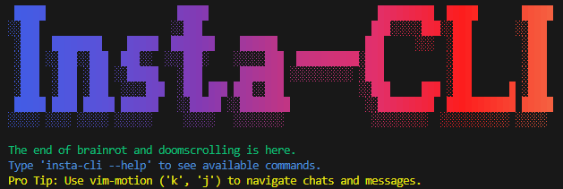

> **The ultimate weapon against brainrot.**
> The fastest, lightest, and most portable Instagram client for your terminal.

$$
\text{InstaCLI} = \lim_{\text{screen time} \to 0} \text{Productivity} \to \infty
$$

[](https://www.npmjs.com/package/@k4ran909/insta-cli)
[](https://www.npmjs.com/package/@k4ran909/insta-cli)
[](https://github.com/k4ran909/insta-cli/blob/main/LICENSE)
[](https://github.com/k4ran909/insta-cli/issues)


> [!WARNING]
> **Disclaimer:** This project is not affiliated with, authorized, or endorsed by Instagram. This is an independent and unofficial project. Using it might violate Meta's Terms of Service. Use at your own risk.

---

## 🚀 Why InstaCLI?

Empower yourself to become a **10x Instagrammer** by minimizing distractions. Reclaim your attention span with an interface designed for meaningful connection, not doom-scrolling.

-   🚫 **Anti-Brainrot:** Chat with friends without falling into the algorithmic void.
-   ⚡ **High Performance:** Significantly faster and lighter than the web or mobile app.
-   ⌨️ **Keyboard Centric:** 100% keyboard navigation—no mouse or touchscreens required.
-   🖥️ **Cross-Platform:** Runs everywhere: Linux servers, macOS, Windows (CMD/PowerShell), and inside VSCode.
-   🎨 **Modern TUI:** A beautiful, responsive terminal user interface built with React & Ink.

---

## 📦 Installation

We recommend the **TypeScript client** for the best performance, security, and feature support.

### NPM (Recommended)

Quickly install globally using `npm`:

```bash
npm install -g @k4ran909/insta-cli
```

### Homebrew (macOS / Linux)

Install via our custom tap:

```bash
brew tap supreme-gg-gg/tap
brew install insta-cli
```

> **Note:** For development updates and other installation methods, check [DEVELOPMENT.md](./DEVELOPMENT.md).

---

## 🛠️ Usage

Once installed, use the `insta-cli` command to access the tool.

### Core Commands

| Command | Description |
| :--- | :--- |
| `insta-cli` | Display title art and version info |
| `insta-cli --help` | View all available commands and flags |
| `insta-cli chat` | **Launch the main chat interface** |
| `insta-cli feed` | View your feed (posts from follows) |
| `insta-cli stories` | View stories from follows |
| `insta-cli notify` | Check notifications (inbox, mentions, etc) |

### Authentication

| Command | Description |
| :--- | :--- |
| `insta-cli auth login` | Login interactively (use `--username` to skip prompt) |
| `insta-cli auth switch <user>` | Switch between saved accounts |
| `insta-cli auth whoami` | Show currently logged-in user |
| `insta-cli auth logout` | Logout and clear local session |

> [!TIP]
> **Multi-Account Support:** Login to multiple accounts and switch between them instantly with `auth switch`.

---

## 💬 Chat Interface

The chat interface is the heart of InstaCLI. Navigate your inbox and threads using your keyboard.

**Navigation:**
-   `↑` / `k`: Move Up
-   `↓` / `j`: Move Down
-   `Enter`: Open Thread / Send Message
-   `Tab`: Autocomplete file paths

**Chat Commands:**
Inside a thread, use these commands:

```bash
:reply <text>               # Reply to the selected message
:react <emoji | :name:>     # React to a message (e.g., :react :thumbsup:)
:unsend                     # Unsend the selected message
:upload <path>              # Upload an image or video
:select                     # Toggle selection mode
```

> **Pro Tip:** Type `#` followed by a file path (e.g., `#./meme.png`) to quickly attach a file.

---

## ⚙️ Configuration

Customize your experience. Config file is stored at `~/.insta-cli/config.ts.yaml`.

Run `insta-cli config` to view current settings or `insta-cli config edit` to open them.

| Key | Default | Description |
| :--- | :--- | :--- |
| `image.protocol` | `"halfBlock"` | Image rendering protocol. Options: `ascii`, `braille`, `halfBlock`, `kitty`, `iterm2`, `sixel`. |
| `feed.feedType` | `"list"` | Feed layout style. Options: `timeline`, `list`. |

> **Image Rendering:** We auto-detect the best protocol for your terminal. If images look broken, try setting `image.protocol` manually. Note: `sixel` and `iterm2` require compatible terminals.

---

## 🐍 Python Client (Legacy)

> The Python client (located in `./instagram/`) is the original implementation of InstaCLI.

While we recommend the TypeScript version, the Python client offers a classic `curses`-based UI and unique plugins (like LaTeX rendering).


[](https://pypi.org/project/instag-cli/)
[](https://pepy.tech/projects/instag-cli)


```bash
pip install instag-cli
```
*Note: The Python binary links to `instagram`, whereas TypeScript links to `insta-cli`.*

> [!CAUTION]
> Avoid using both clients simultaneously with the same account to prevent flagging by Instagram's anti-bot systems.

---

## 🤝 Contributing

Contributions are welcome!
Please read [CONTRIBUTING.md](CONTRIBUTING.md) before getting started.

**Note:** We do not accept contributions that add botting/automation features (spamming, scraping, etc.).

## 🐛 Reporting Issues

If you encounter bugs, please report them on [GitHub Issues](https://github.com/k4ran909/insta-cli/issues).
Attach logs from `~/.insta-cli/logs/` to help us debug.

## 🌟 Star History

[](https://www.star-history.com/#k4ran909/insta-cli&type=date&legend=top-left)

---

### Sister Projects

Check out our contributions to the Ink ecosystem:
- [Ink Picture](https://github.com/endernoke/ink-picture) - Ink-native image component.
- [Wax](https://github.com/endernoke/wax) - Ink routing framework.
